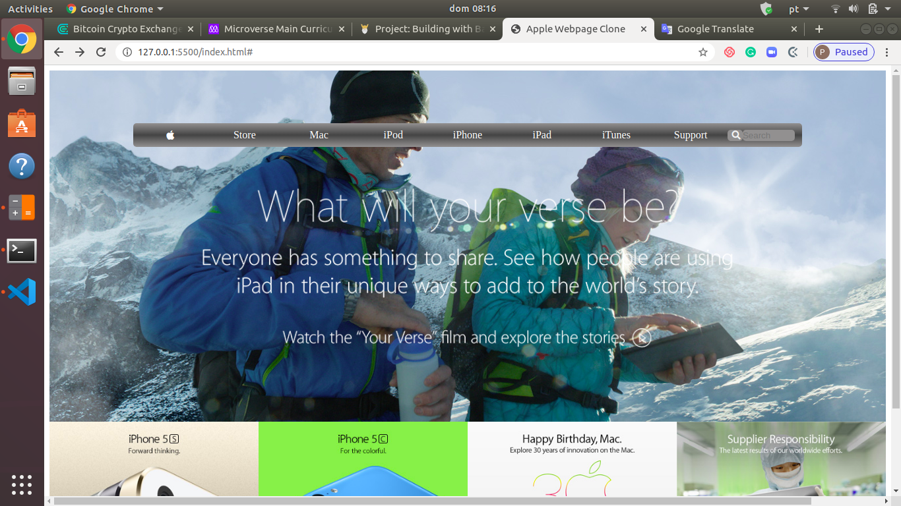

# Apple.com Page Clone

> This is my fourth project from the Microverse Curriculum. It consists of cloning the apple.com webpage using HTML and CSS, building with backgrounds and gradients. Small details were ignored, as the main purpose was to mimic the page's appearance. The links go no-where.

## Built With

- HTML
- CSS
- VLC, Git, GitHub

## Live Demo

[Live Demo Link](https://rawcdn.githack.com/Albertino2020/apple.com-clone/6da69fc522bd31603d3ca2ceaec20c35c4b78d60/index.html)

## Authors

👤 Albertino Francisco

- Github: [@albertino2020](https://github.com/albertino2020)
- Twitter: [@albertino2050](https://twitter.com/albertino2050)
- Linkedin: [linkedin](https://linkedin.com/in/boamorte)

## 🤝 Contributing

Contributions, issues and feature requests are welcome!

Feel free to check the [issues page](issues/).

## Show your support

Give a ⭐️ if you like this project!

## 📝 License

This project is [MIT](lic.url) licensed.
